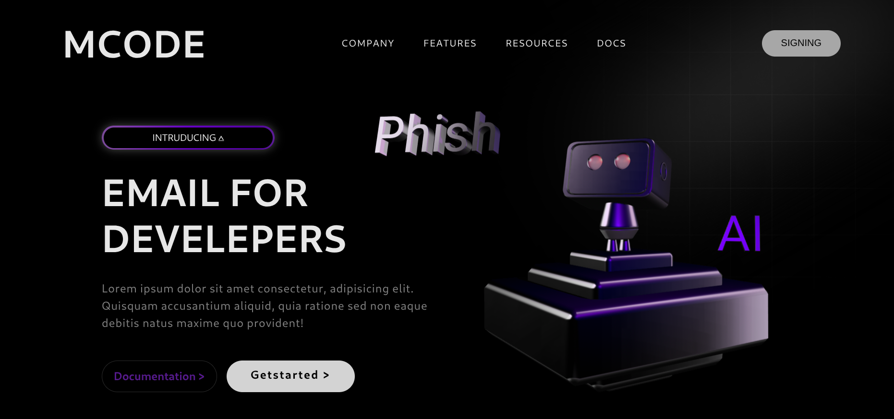

# 3D Project — CSS Tricks Demo


A small, self-contained demo showing a 3D animation built with HTML and CSS. The project demonstrates CSS transforms, perspective, keyframe animations, and responsive layout techniques to create a simple 3D effect without JavaScript.

Features
- Minimal HTML/CSS demo — no build step required
- Uses `transform`, `transform-style`, and `perspective` for depth
- Keyframe animations for smooth motion
- Lightweight and easy to adapt for learning or quick prototypes

How to view
- Open [index.html](index.html) in your browser (double-click or drag into a browser window)
- Or serve the folder with a simple HTTP server for proper relative asset handling:

```bash
# from the 3d-project directory
# then open http://localhost:8000 in your browser
```

Project structure
- `index.html` — demo page and markup
- `style.css` — primary styles and 3D animation rules
- `README.md` — this file

Customization
- Tweak `style.css` to change animation timing, colors, or transform values.
- Add more elements to `index.html` and group them with containers to create layered 3D scenes.

Credits
- Inspired by CSS-Tricks articles and experiments with CSS 3D transforms.

License
- Feel free to reuse or adapt this demo for learning and small projects.
